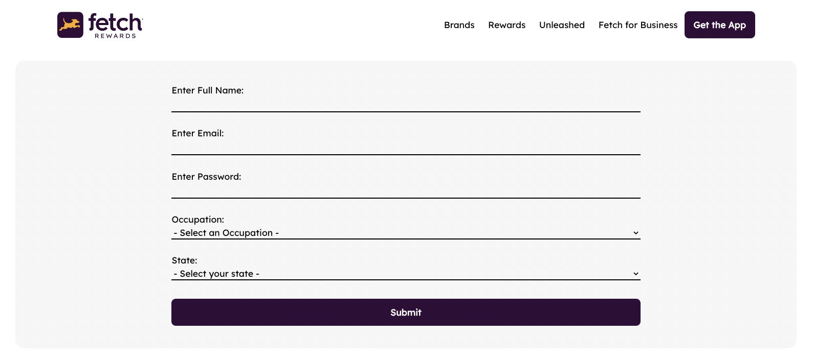
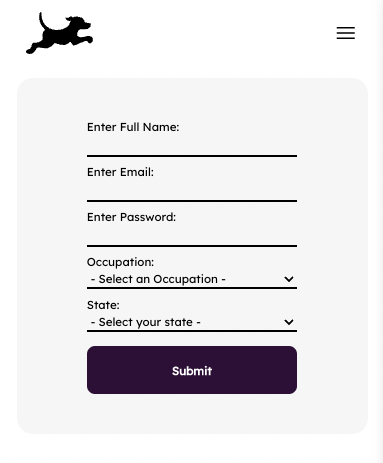

# Young Kim Fetch Takehome

### Hello! My name is Young Kim and I'm excited to show you my work. I'm really looking forward to hearing your feedback.

## Getting Started

<br/>
To get this app running on your machine, navigate to your desired directory and run:
```
git clone https://github.com/ykim770/fetch-takehome.git
```
</br>
<br/>
Install dependencies with the relevant command for your package manager:
```
npm i || yarn 
```
</br>
<br/>
To get the app running locally on a development server, run:
```
npm start
```
</br>
<br/>
To run tests, run the following command and select E2E Testing:
```
npm run cypress
```

## About the application

Try resizing your windows to view the app in desktop mode


And view it for mobile!


> **NOTE: Form validation exists**
>
> Name should take the format of: first last
> Email should have the format of zzz@zzz.com
> Passwords should be at least 5 characters, and at most 20
> Occupation and state must be selected
